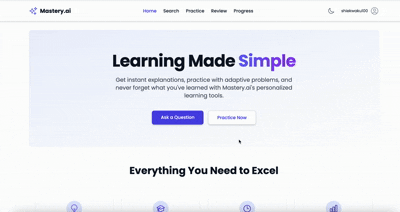
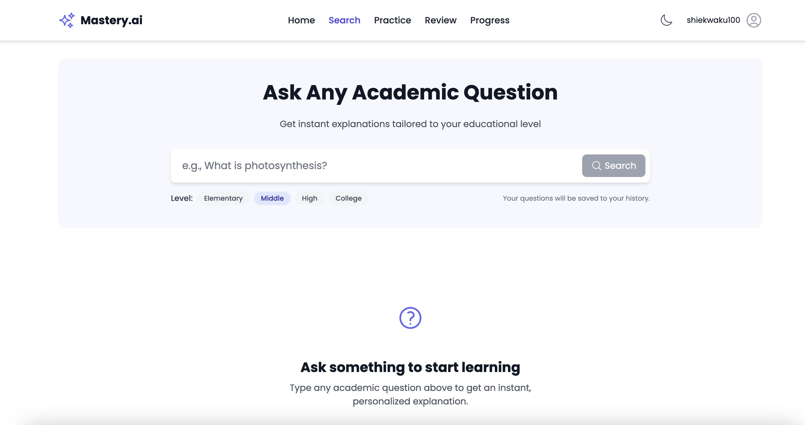
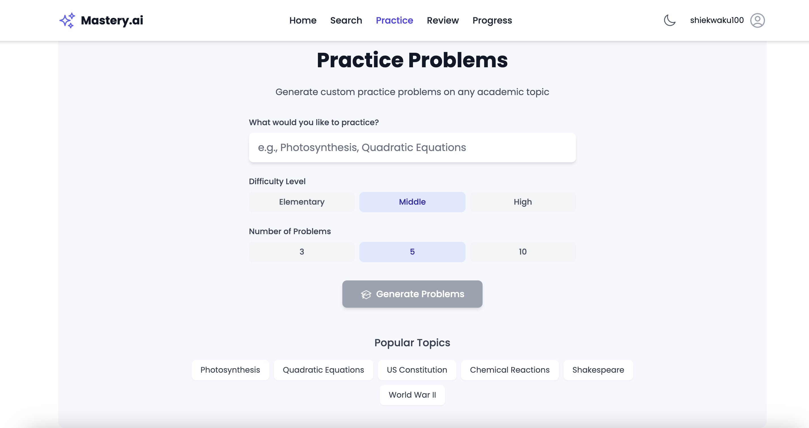
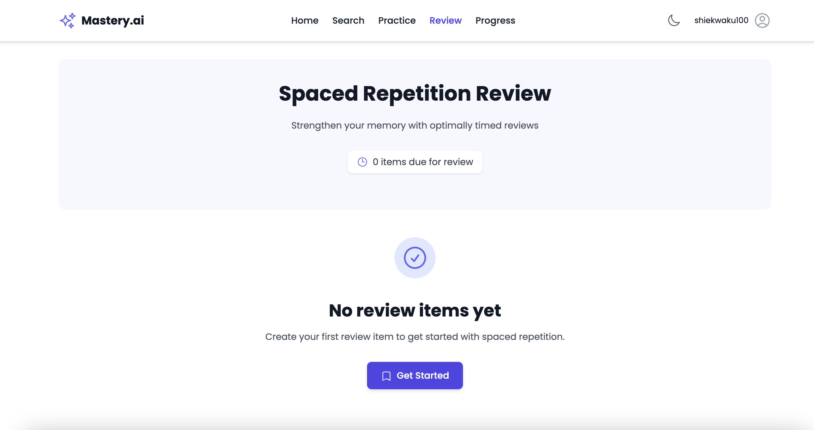
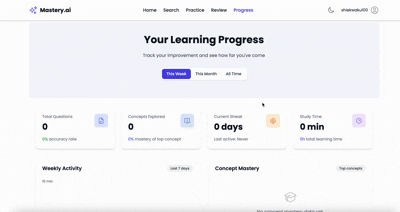

# Mastery.ai: Intelligent Learning Companion

<p align="center">
  
</p>

> Transform moments of confusion into opportunities for mastery

## 📚 Overview

Mastery.ai is an intelligent learning companion that transforms how students overcome academic obstacles by providing instant, personalized help when they need it most. Using AI-powered explanations, curated educational videos, adaptive practice problems, and scientifically-backed spaced repetition, Mastery.ai turns moments of confusion into opportunities for long-term knowledge mastery.

## 🌟 Key Features: The Four Pillars

### 1. Ask-&-Learn

<p align="center">
  
</p>

- **Instant Explanations**: Type any academic question and receive age-appropriate explanations
- **Visual Learning Support**: Automatically fetched relevant educational videos from YouTube
- **Natural Language Search**: Ask questions in your own words, just like you would to a tutor

### 2. Deliberate Practice

<p align="center">
  
</p>

- **Auto-generated Problems**: Custom practice questions based on your searched concepts
- **Immediate Feedback**: Instant verification and explanation of your answers
- **Progressive Hint System**: Get unstuck with helpful hints that guide without giving away the answer

### 3. Spaced Review

<p align="center">
  
</p>

- **Scientific Retention**: SM-2 algorithm schedules reviews at optimal intervals for long-term memory
- **Self-assessment**: Rate your recall quality to improve the scheduling algorithm
- **Review Reminders**: Never forget what you've learned with timely review notifications

### 4. Progress Pulse

<p align="center">
  
</p>

- **Visual Progress Tracking**: See your learning journey through intuitive charts and graphs
- **Mastery Metrics**: Track concept mastery percentages across different subject areas
- **Learning Streaks**: Build momentum with daily learning streak tracking
- **Shareable Reports**: Generate reports to share progress with parents or teachers

## 🛠️ Technology Stack

### Frontend
- **React**: Component-based UI development
- **Tailwind CSS**: Responsive styling framework
- **JavaScript**: Interactive elements and client-side logic

### Backend
- **Node.js**: Server environment
- **Express.js**: API routing
- **MongoDB**: User data and learning history storage

### Integrations
- **OpenAI API**: Powers the AI explanation generation
- **YouTube Data API**: Fetches relevant educational videos
- **Firebase Authentication**: Handles email + OTP login

## 💻 Installation

### Prerequisites
- Node.js (v14.0.0 or higher)
- npm (v6.0.0 or higher)
- MongoDB (v4.0 or higher)

### Setup Instructions

1. **Clone the repository**
   ```bash
   git clone https://github.com/yourusername/Mastery.ai.git
   cd Mastery.ai
   ```

2. **Install dependencies**
   ```bash
   # Install server dependencies
   npm install
   
   # Install client dependencies
   cd client
   npm install
   cd ..
   ```

3. **Environment setup**
   - Create a `.env` file in the root directory
   - Add the following variables:
     ```
     # Server Configuration
     PORT=5000
     MONGODB_URI=your_mongodb_connection_string
     
     # API Keys
     OPENAI_API_KEY=your_openai_api_key
     YOUTUBE_API_KEY=your_youtube_api_key
     
     # Firebase Configuration
     FIREBASE_API_KEY=your_firebase_api_key
     FIREBASE_AUTH_DOMAIN=your_firebase_auth_domain
     FIREBASE_PROJECT_ID=your_firebase_project_id
     FIREBASE_STORAGE_BUCKET=your_firebase_storage_bucket
     FIREBASE_MESSAGING_SENDER_ID=your_firebase_messaging_sender_id
     FIREBASE_APP_ID=your_firebase_app_id
     ```

4. **Start the development server**
   ```bash
   # Run the full stack (concurrently)
   npm run dev
   
   # OR run frontend and backend separately
   npm run server
   npm run client
   ```

5. **Access the application**
   - Open your browser and go to `http://localhost:3000`


## 📋 Usage Guide

### Creating an Account
1. Open the application and click "Sign Up"
2. Enter your email address
3. Check your email for the OTP (One-Time Password)
4. Enter the OTP to complete registration

### Using Ask-&-Learn
1. Type your academic question in the search box
2. Review the AI-generated explanation
3. Watch the curated educational videos
4. Save helpful explanations to your library

### Practicing Concepts
1. After searching a concept, click "Practice Now"
2. Complete the generated practice problems
3. Submit your answers and review feedback
4. Request hints if needed

### Managing Reviews
1. Navigate to the "Review" section
2. Complete due reviews
3. Rate your recall quality for each item
4. View upcoming review schedule

### Tracking Progress
1. Visit the "Progress" dashboard
2. Review your activity history and learning streaks
3. Examine subject mastery percentages
4. Generate and share progress reports

## 🗺️ Roadmap

### Coming Soon
- **Personalized Learning Paths**: AI-driven recommendations for what to learn next
- **Mobile Applications**: Native iOS and Android apps
- **Offline Mode**: Core functionality without internet connection
- **Advanced Analytics**: Deeper insights into learning patterns

### Future Enhancements
- **Social Learning Features**: Study groups and peer help
- **Expanded Content Types**: Interactive simulations and educational games
- **Educator Dashboard**: Tools for teachers to monitor class progress
- **LMS Integration**: Connectivity with popular learning management systems


## 📜 License

This project is licensed under the MIT License - see the [LICENSE](LICENSE) file for details.

## 🙏 Acknowledgements

- [OpenAI](https://openai.com/) for providing the AI explanation capabilities
- [YouTube](https://developers.google.com/youtube) for the educational video content
- All the educators and learners who provided feedback during development

---

<p align="center">
  Made with ❤️ for learners everywhere
</p>
